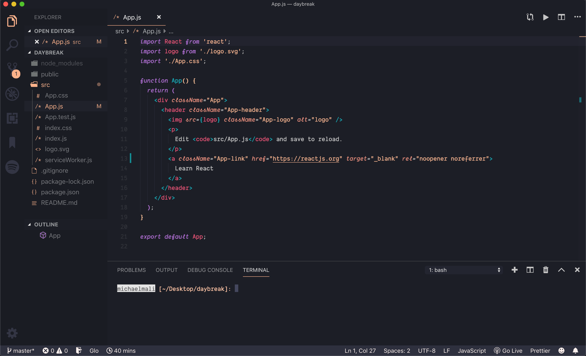

  

---

  

## Installation

1. Open the **Extensions** sidebar in VS Code
2. Search for `Daybreak Theme`
3. Click **Install**
4. Open the **Command Palette** with `Ctrl+Shift+P` or `⇧⌘P`
5. Select **Preferences: Color Theme** and choose Daybreak.
6. Select **Preferences: File Icon Theme** and choose Daybreak.
7. Enjoy! 🎉 Also, check out some of the personalization options below...

## Personalization

Coming soon.

_For more info on theming, visit the [Theme Authoring Guide](https://code.visualstudio.com/api/extension-capabilities/theming) and [Theme Color Reference](https://code.visualstudio.com/api/references/theme-color)._

## License

[MIT](LICENSE) © [Mike Mali](https://github.com/mtdmali)
